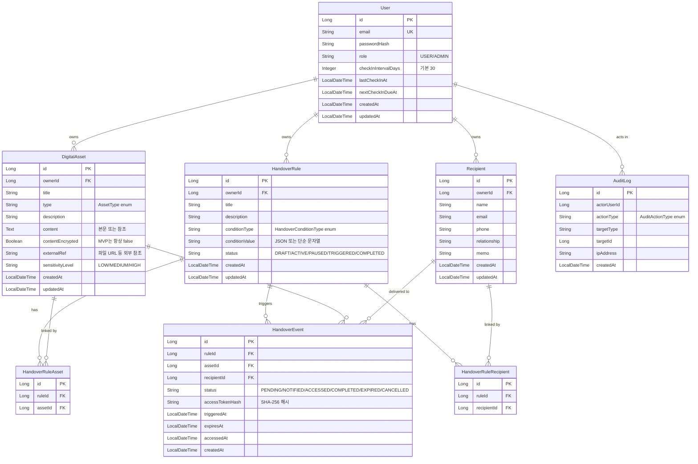

# ERD (Entity Relationship Diagram)

> DAHP 백엔드의 데이터 모델. JPA 엔티티 매핑의 기준.

작성일: 2026-05-13

---

## 1. 엔티티 목록 (MVP 기준, 9개)

| 엔티티 | 역할 | Sprint |
|---|---|---|
| `User` | 사용자 계정 | Sprint 2 |
| `DigitalAsset` | 디지털 자산 | Sprint 2 |
| `Recipient` | 수령인 | Sprint 3 |
| `HandoverRule` | 인계 규칙 | Sprint 3 |
| `HandoverRuleAsset` | 규칙 ↔ 자산 M:N 매핑 | Sprint 3 |
| `HandoverRuleRecipient` | 규칙 ↔ 수령인 M:N 매핑 | Sprint 3 |
| `HandoverEvent` | 트리거된 인계 이벤트 | Sprint 3 |
| `AuditLog` | 감사 로그 | Sprint 4 |
| `BaseEntity` | (추상) createdAt, updatedAt | Sprint 2 |

**제외**: `Notification` 엔티티는 MVP에서 제외 (콘솔 출력만, 인터페이스로 추상화).
**제외**: `CheckIn` 별도 엔티티 없음 — `User`에 필드 통합 (lastCheckInAt, nextCheckInDueAt, checkInIntervalDays).

---

## 2. ERD 다이어그램



---

## 3. 엔티티 상세

### 3.1 User

| 컬럼 | 타입 | 제약 | 설명 |
|---|---|---|---|
| `id` | BIGINT | PK, auto | |
| `email` | VARCHAR(255) | UNIQUE, NOT NULL | 로그인 ID |
| `password_hash` | VARCHAR(60) | NOT NULL | BCrypt |
| `role` | VARCHAR(20) | NOT NULL | `USER`, `ADMIN` |
| `check_in_interval_days` | INTEGER | DEFAULT 30 | 다음 체크인까지 일수 |
| `last_check_in_at` | TIMESTAMP | NULL | |
| `next_check_in_due_at` | TIMESTAMP | NULL | 가입 직후 = createdAt + interval |
| `created_at` | TIMESTAMP | NOT NULL | |
| `updated_at` | TIMESTAMP | NOT NULL | |

### 3.2 DigitalAsset

| 컬럼 | 타입 | 제약 | 설명 |
|---|---|---|---|
| `id` | BIGINT | PK, auto | |
| `owner_id` | BIGINT | FK → User.id, NOT NULL | |
| `title` | VARCHAR(200) | NOT NULL | |
| `type` | VARCHAR(20) | NOT NULL | `AssetType` enum |
| `description` | TEXT | NULL | |
| `content` | TEXT | NULL | 자산 본문 (계정 정보, 노트 내용 등) |
| `content_encrypted` | BOOLEAN | DEFAULT false | MVP는 항상 false |
| `external_ref` | VARCHAR(500) | NULL | 파일 URL 등 외부 자원 참조 |
| `sensitivity_level` | VARCHAR(20) | DEFAULT 'MEDIUM' | `LOW`, `MEDIUM`, `HIGH` |
| `created_at` | TIMESTAMP | NOT NULL | |
| `updated_at` | TIMESTAMP | NOT NULL | |

**인덱스**: `(owner_id, type)`, `(owner_id, created_at DESC)` 권장.

**AssetType enum**:
- `ACCOUNT` (계정 정보)
- `FILE` (파일 참조)
- `NOTE` (메모)
- `LINK` (URL)
- `MESSAGE` (메시지/유서 텍스트)
- `DOCUMENT` (문서)
- `ETC`

**SensitivityLevel enum**: `LOW`, `MEDIUM`, `HIGH`.

### 3.3 Recipient

| 컬럼 | 타입 | 제약 | 설명 |
|---|---|---|---|
| `id` | BIGINT | PK, auto | |
| `owner_id` | BIGINT | FK → User.id, NOT NULL | |
| `name` | VARCHAR(100) | NOT NULL | |
| `email` | VARCHAR(255) | NOT NULL | 알림 발송 대상 |
| `phone` | VARCHAR(30) | NULL | |
| `relationship` | VARCHAR(50) | NULL | 자유 텍스트 (가족, 친구, 변호사 등) |
| `memo` | VARCHAR(500) | NULL | |
| `created_at` | TIMESTAMP | NOT NULL | |
| `updated_at` | TIMESTAMP | NOT NULL | |

**인덱스**: `(owner_id)`.

### 3.4 HandoverRule

| 컬럼 | 타입 | 제약 | 설명 |
|---|---|---|---|
| `id` | BIGINT | PK, auto | |
| `owner_id` | BIGINT | FK → User.id, NOT NULL | |
| `title` | VARCHAR(200) | NOT NULL | |
| `description` | TEXT | NULL | |
| `condition_type` | VARCHAR(30) | NOT NULL | `HandoverConditionType` enum |
| `condition_value` | VARCHAR(500) | NULL | 조건 파라미터 (날짜, 일수 등) |
| `status` | VARCHAR(20) | NOT NULL, DEFAULT 'DRAFT' | `HandoverRuleStatus` enum |
| `created_at` | TIMESTAMP | NOT NULL | |
| `updated_at` | TIMESTAMP | NOT NULL | |

**HandoverConditionType enum** (MVP는 3개 자동 평가):
- `MANUAL_APPROVAL` ✅ MVP — 소유자가 수동 trigger 호출 시 발동
- `SPECIFIC_DATE` ✅ MVP — `@Scheduled`가 지정 날짜 도래 시 자동 트리거
- `INACTIVITY_PERIOD` ✅ MVP — `@Scheduled`가 사용자 lastCheckInAt 검사, N일 초과 시 자동 트리거
- `PERIODIC_CHECK_FAILED` ⏸ P2
- `EMERGENCY_REQUEST` ⏸ P2

**conditionValue 포맷 예시**:
- `MANUAL_APPROVAL`: null
- `SPECIFIC_DATE`: ISO-8601 날짜 문자열 (예: `"2026-12-31"`)
- `INACTIVITY_PERIOD`: 일수 문자열 (예: `"30"`)

**HandoverRuleStatus enum**:
- `DRAFT` (생성 직후)
- `ACTIVE` (조건 평가 대상)
- `PAUSED` (일시 정지)
- `TRIGGERED` (조건 충족, 이벤트 생성됨)
- `COMPLETED` (모든 이벤트 종료)
- `CANCELLED`

**상태 전이**:
```
DRAFT → ACTIVE (activate API)
ACTIVE ↔ PAUSED (activate/pause API)
ACTIVE → TRIGGERED (trigger API)
TRIGGERED → COMPLETED (모든 HandoverEvent가 COMPLETED 또는 EXPIRED 되면)
ANY → CANCELLED (delete or explicit cancel)
```

### 3.5 HandoverRuleAsset (M:N 매핑)

| 컬럼 | 타입 | 제약 |
|---|---|---|
| `id` | BIGINT | PK, auto |
| `rule_id` | BIGINT | FK → HandoverRule.id |
| `asset_id` | BIGINT | FK → DigitalAsset.id |

**UNIQUE**: `(rule_id, asset_id)`.

### 3.6 HandoverRuleRecipient (M:N 매핑)

| 컬럼 | 타입 | 제약 |
|---|---|---|
| `id` | BIGINT | PK, auto |
| `rule_id` | BIGINT | FK → HandoverRule.id |
| `recipient_id` | BIGINT | FK → Recipient.id |

**UNIQUE**: `(rule_id, recipient_id)`.

### 3.7 HandoverEvent

| 컬럼 | 타입 | 제약 | 설명 |
|---|---|---|---|
| `id` | BIGINT | PK, auto | |
| `rule_id` | BIGINT | FK → HandoverRule.id, NOT NULL | |
| `asset_id` | BIGINT | FK → DigitalAsset.id, NOT NULL | |
| `recipient_id` | BIGINT | FK → Recipient.id, NOT NULL | |
| `status` | VARCHAR(20) | NOT NULL | `HandoverEventStatus` enum |
| `access_token_hash` | VARCHAR(64) | NOT NULL, UNIQUE | SHA-256 해시 (64자 hex) |
| `triggered_at` | TIMESTAMP | NOT NULL | |
| `expires_at` | TIMESTAMP | NOT NULL | triggered_at + 72h |
| `accessed_at` | TIMESTAMP | NULL | 첫 접근 시 채워짐 |
| `created_at` | TIMESTAMP | NOT NULL | |

**HandoverEventStatus enum**:
- `PENDING` (이벤트 생성, 알림 발송 전)
- `NOTIFIED` (수령인에게 알림 발송 완료)
- `ACCESSED` (수령인이 토큰으로 접근 완료, 1회 사용)
- `COMPLETED` (`ACCESSED` 후 또는 명시적 종료)
- `EXPIRED` (만료, 미접근)
- `CANCELLED` (트리거 후 취소)

**인덱스**:
- `access_token_hash` (UNIQUE) — 토큰 검증 시 lookup
- `(recipient_id, status)` — 수령인별 활성 이벤트 조회
- `(rule_id, status)` — 규칙별 이벤트 집계

### 3.8 AuditLog

| 컬럼 | 타입 | 제약 |
|---|---|---|
| `id` | BIGINT | PK, auto |
| `actor_user_id` | BIGINT | NULL (익명 가능) |
| `action_type` | VARCHAR(50) | NOT NULL |
| `target_type` | VARCHAR(50) | NULL (예: ASSET, RULE) |
| `target_id` | BIGINT | NULL |
| `ip_address` | VARCHAR(45) | NULL (IPv6 max 45자) |
| `created_at` | TIMESTAMP | NOT NULL |

**AuditActionType enum (MVP 5개)**:
- `USER_LOGIN`
- `ASSET_CREATED`
- `ASSET_DELETED`
- `RULE_TRIGGERED`
- `HANDOVER_ACCESSED`

---

## 4. 설계 결정 요약

### 4.1 M:N을 별도 엔티티로
`@ManyToMany` 어노테이션 대신 명시적 매핑 엔티티(`HandoverRuleAsset`, `HandoverRuleRecipient`) 사용.

**이유**: 나중에 매핑에 메타데이터 추가 가능 (예: "이 자산은 이 수령인에게만"). `@ManyToMany`는 메타 컬럼 추가 시 마이그레이션 비용 큼.

### 4.2 HandoverEvent의 단위: cross product
규칙에 자산 3개 + 수령인 2명이면 트리거 시 **6개의 HandoverEvent** 생성.

**이유**:
- 각 자산-수령인 조합별 접근/만료 개별 추적 가능
- 한 수령인이 자산별로 다른 시점에 조회해도 상태 추적 정확
- 토큰도 조합별로 별도 → 보안 격리

### 4.3 accessToken은 해시만 저장
원본 토큰은 발급 시 한 번만 응답에 노출, DB에는 SHA-256 해시만.

**이유**: DB 유출 시에도 토큰 직접 사용 불가. BCrypt는 자산 내용에 쓰지 말 것(BCrypt는 단방향, 비밀번호용).

### 4.4 Notification 엔티티 제외
MVP에서는 `NotificationService` 인터페이스 + `ConsoleNotificationService`만. DB 테이블 X.

**이유**: 알림 이력 조회 기능을 MVP에 넣지 않음. P2에서 추가 가능 (인터페이스만 있으므로 코드 영향 최소).

### 4.5 CheckIn 별도 엔티티 없음
`User` 엔티티에 3개 필드 추가:
- `checkInIntervalDays` (기본 30)
- `lastCheckInAt`
- `nextCheckInDueAt`

**이유**: 체크인은 단순 카운터 갱신. 이력 추적이 MVP에 필요 없음. P2에서 별도 엔티티로 분리 가능.

### 4.6 PostgreSQL 활용
`HandoverRule.condition_value`는 향후 JSONB로 전환 가능 (예: `INACTIVITY_PERIOD`의 일수 + 알림 주기 등 복합 파라미터).
MVP에서는 단순 String으로 시작 (e.g., `"30"`, `"2026-12-31"`).

---

## 5. 변경 이력

| 날짜 | 내용 |
|---|---|
| 2026-05-13 | 초안 작성 |
| 2026-05-13 | HandoverConditionType MVP 범위 확장: INACTIVITY_PERIOD를 MVP에 포함, 자동 평가 스케줄러 추가 |
