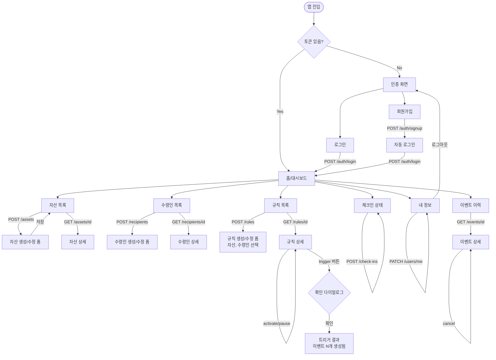
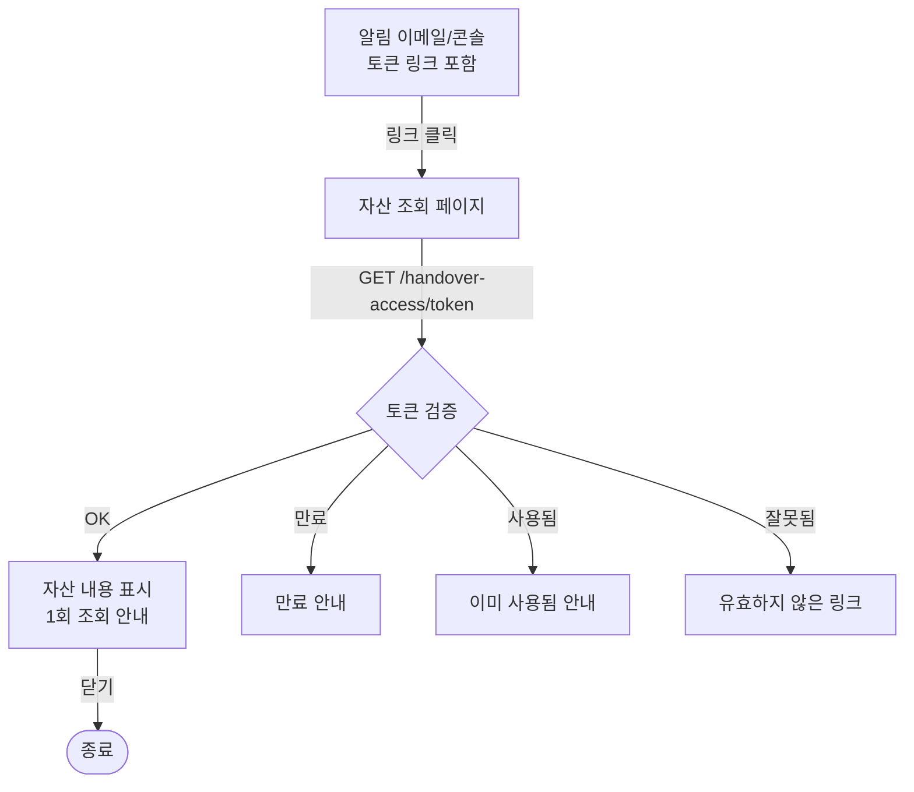
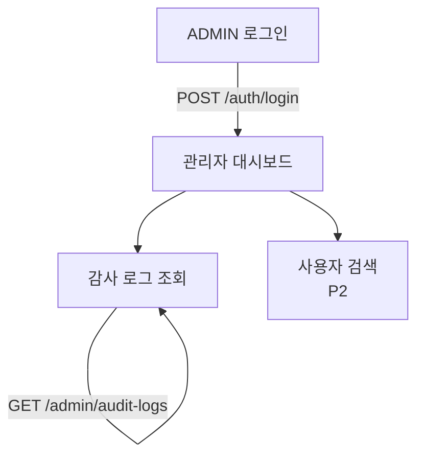
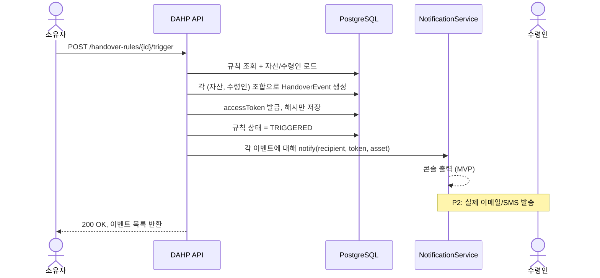
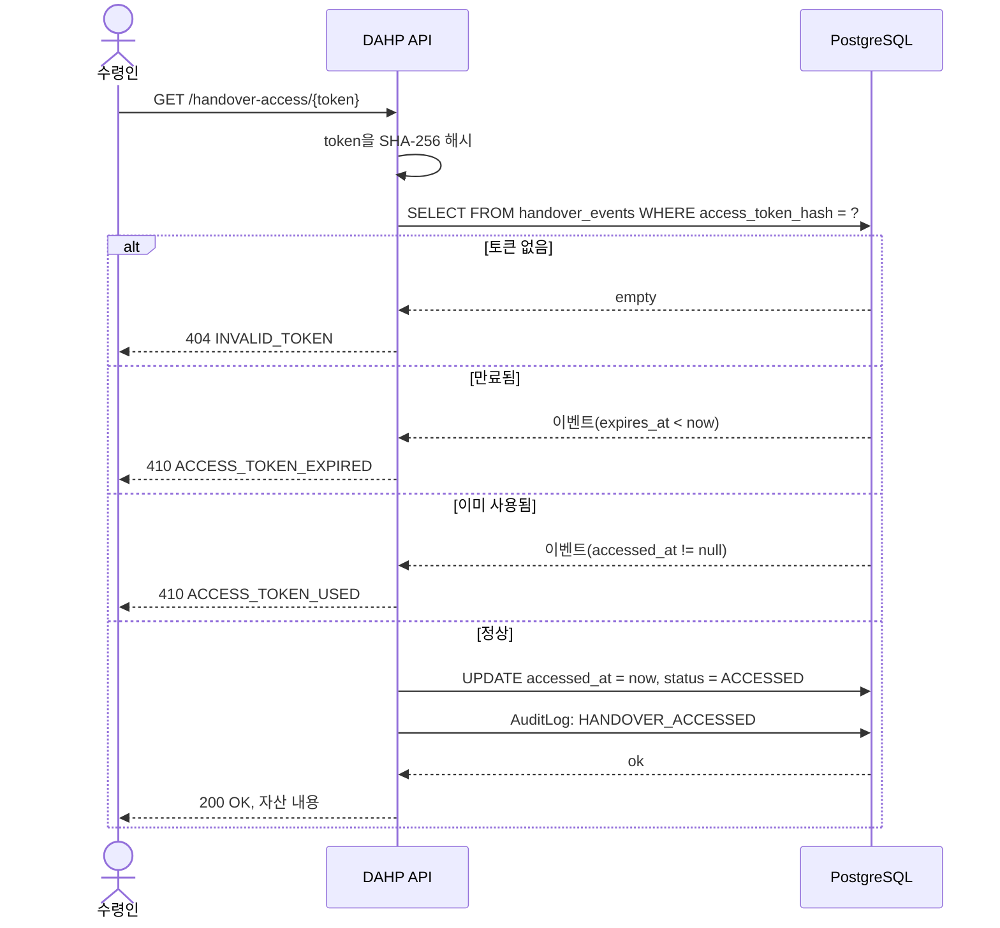

# 화면 흐름도 (Wireframe / Screen Flow)

> DAHP는 백엔드 프로젝트이지만, 클라이언트가 어떻게 API를 호출할지 흐름이 명확해야 API 설계가 정합성을 가짐. 이 문서는 가상 클라이언트의 화면 전이 흐름을 정리.

작성일: 2026-05-13

---

## 1. 사용자 (Primary User) 화면 흐름

### 1.1 전체 흐름도

---

### 1.2 화면별 호출 API

| 화면 | 호출 API | 비고 |
|---|---|---|
| 회원가입 | `POST /api/auth/signup` → `POST /api/auth/login` | 가입 후 자동 로그인 |
| 로그인 | `POST /api/auth/login` | 토큰 저장 |
| 홈/대시보드 | `GET /api/users/me`, `GET /api/check-ins/status` | 환영 메시지 + 체크인 상태 위젯 |
| 자산 목록 | `GET /api/assets?page=0&size=20&type=&q=` | 필터/검색 |
| 자산 상세 | `GET /api/assets/{id}` | |
| 자산 생성 폼 | `POST /api/assets` | |
| 자산 수정 폼 | `GET /api/assets/{id}` → `PATCH /api/assets/{id}` | |
| 자산 삭제 | `DELETE /api/assets/{id}` | 확인 다이얼로그 |
| 수령인 목록 | `GET /api/recipients` | |
| 수령인 폼 | `POST` / `PATCH /api/recipients` | |
| 규칙 목록 | `GET /api/handover-rules` | 상태별 필터 가능 |
| 규칙 생성 폼 | `GET /api/assets` + `GET /api/recipients` → `POST /api/handover-rules` | 자산/수령인 다중 선택 |
| 규칙 상세 | `GET /api/handover-rules/{id}` | 포함된 자산/수령인 목록 |
| 규칙 활성화 | `POST /api/handover-rules/{id}/activate` | |
| 규칙 일시정지 | `POST /api/handover-rules/{id}/pause` | |
| **규칙 트리거** | `POST /api/handover-rules/{id}/trigger` | 확인 다이얼로그 필수 |
| 트리거 결과 | (응답 화면) | 발생한 이벤트 목록 표시 |
| 이벤트 이력 | `GET /api/handover-events` | |
| 이벤트 상세 | `GET /api/handover-events/{id}` | 토큰 원본은 표시 X |
| 이벤트 취소 | `POST /api/handover-events/{id}/cancel` | |
| 체크인 | `POST /api/check-ins` | 버튼 하나 |
| 내 정보 | `GET /api/users/me`, `PATCH /api/users/me` | 체크인 주기 변경 |

---

## 2. 수령인 (Recipient) 화면 흐름

수령인은 **회원가입 없음**. 이메일로 받은 링크를 클릭해 단일 화면 접근.

### 2.1 접근 페이지 응답 처리

| HTTP 응답 | 화면 |
|---|---|
| 200 | 자산 내용 표시 ("이 정보는 1회만 조회 가능합니다" 안내) |
| 404 INVALID_TOKEN | "유효하지 않은 링크입니다" |
| 410 ACCESS_TOKEN_EXPIRED | "이 링크는 만료되었습니다. 소유자에게 문의하세요." |
| 410 ACCESS_TOKEN_USED | "이 링크는 이미 사용되었습니다." |

---

## 3. Admin 화면 흐름 (선택, Sprint 4)

---

## 4. 트리거 시 알림 흐름 (백엔드 내부)

---

## 5. 수령인 토큰 접근 시퀀스

---

## 6. 변경 이력

| 날짜 | 내용 |
|---|---|
| 2026-05-13 | 초안 작성 |
